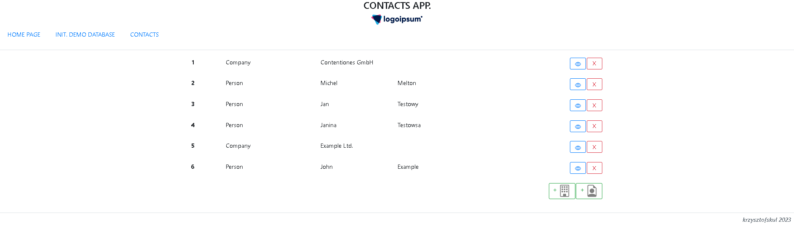
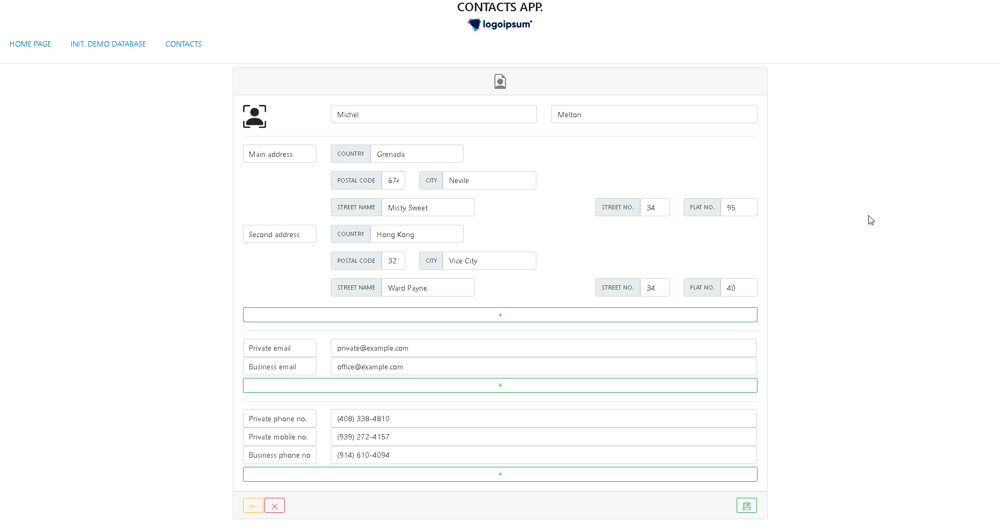

#### INTRODUCTION
Simple hobby application created for testing and developing skills.

#### DESCRIPTION  
This application allows to manage personal contacts with specific functionalities like: 
* create person or company contact entry;
* add more than one address, e-mail and phone number with own titles;
* edit data on the fly;

#### TECHNOLOGY
* Java
* SpringBoot
* Hibernate
* JavaScript/JQuery/Ajax
* Bootstrap
* Thymeleaf

#### LINK

Demo of the application is deployed for testing on railway.com below the link:  

[https://contactsapp-production-fc44.up.railway.app/contacts/startpage](https://contactsapp-production-fc44.up.railway.app/contacts/startpage)

#### SCREENSHOTS

##### LIST OF ALL CONTACTS PAGE
<!--

-->

##### CONTACT DETAILS PAGE
<!--

-->

#### STATUS

in progress

#### CONTACT

krzysztofskul@protonmail.com